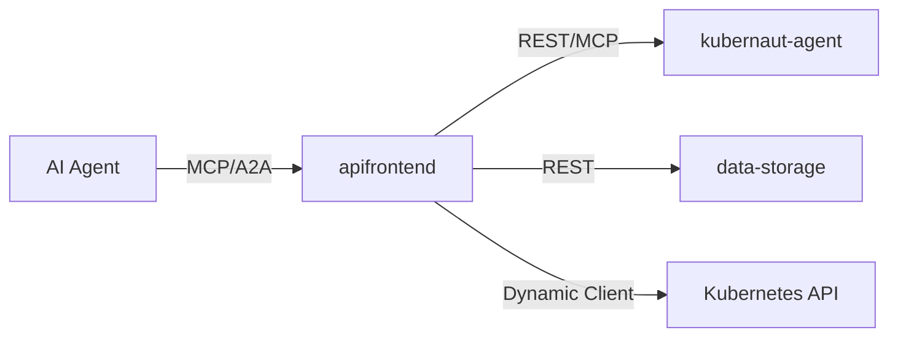

# kubernaut-apifrontend

MCP Streamable HTTP and A2A protocol frontend for the Kubernaut AI-driven remediation platform.

## Overview

The API Frontend serves as the entry point for AI agents interacting with Kubernaut. It exposes:

- **MCP Streamable HTTP** (`/mcp`) — 20 tools for incident triage, remediation orchestration, and cluster inspection
- **A2A Protocol** (`/a2a`) — Agent-to-Agent communication (planned)
- **Agent Card** (`/.well-known/agent.json`) — A2A-compliant service discovery



## Prerequisites

- Go 1.25+
- [Ginkgo](https://onsi.github.io/ginkgo/) (test runner)
- [golangci-lint](https://golangci-lint.run/) v2.11+
- [controller-gen](https://book.kubebuilder.io/reference/controller-gen) (code generation)

## Quickstart

```bash
# Build
make build

# Run locally (uses default config)
make run

# Run unit tests
make test-unit

# Run MCP bridge tests (with optional tier filter)
make test-bridge
GINKGO_LABEL=tier1 make test-bridge

# Lint
make lint

# See all targets
make help
```

## Configuration

The service reads configuration from `/etc/apifrontend/config.yaml` at startup. If the file is absent, sensible defaults are applied. See [`deploy/configmap.yaml`](deploy/configmap.yaml) for a complete example.

RBAC roles are loaded from `/etc/apifrontend/rbac_roles.yaml`. If absent, all authenticated users can invoke all tools (`"*": ["*"]`).

## Architecture

- [`docs/design/ARCHITECTURE.md`](docs/design/ARCHITECTURE.md) — system design, metrics catalog, and request flow
- [`docs/design/CONTAINER_IMAGE.md`](docs/design/CONTAINER_IMAGE.md) — container build spec (ADR-027/028)
- [`docs/design/TOOL_EXECUTION_MODEL.md`](docs/design/TOOL_EXECUTION_MODEL.md) — MCP tool dispatch model
- [`docs/adr/`](docs/adr/) — Architecture Decision Records

## Container Image

```bash
# Production build (scratch, multi-arch)
podman build --target production -t apifrontend:latest .

# Development build (ubi-minimal, coverage support)
podman build --build-arg GOFLAGS=-cover -t apifrontend:dev .
```

See [CONTAINER_IMAGE.md](docs/design/CONTAINER_IMAGE.md) for full specification.

## Project Structure

```
cmd/apifrontend/       Main binary entry point
internal/
  auth/                JWT validation, impersonation, RBAC
  handler/             HTTP router, MCP handler, bridge, agent card
  tools/               20 MCP tool implementations (CRD, KA, DS)
  config/              Configuration loading and hot-reload
  metrics/             Prometheus metric definitions
  audit/               FedRAMP AU-2 audit event emission
  resilience/          Circuit breakers, retry, K8s dynamic resilience
  ratelimit/           IP and per-user rate limiting
  session/             Investigation session lifecycle
  streaming/           SSE connection tracking
  security/            Error redaction, input validation
  validate/            Kubernetes name validators
api/                   CRD type definitions
deploy/                Development manifests, Helm chart, Prometheus rules
docs/                  Design docs, ADRs, test plans, security catalog
tests/performance/     k6 load test scripts
```

## Related Repositories

- [kubernaut](https://github.com/jordigilh/kubernaut) — Core platform (services, CRDs, operator)
- [kubernaut-operator](https://github.com/jordigilh/kubernaut-operator) — Production deployment operator
