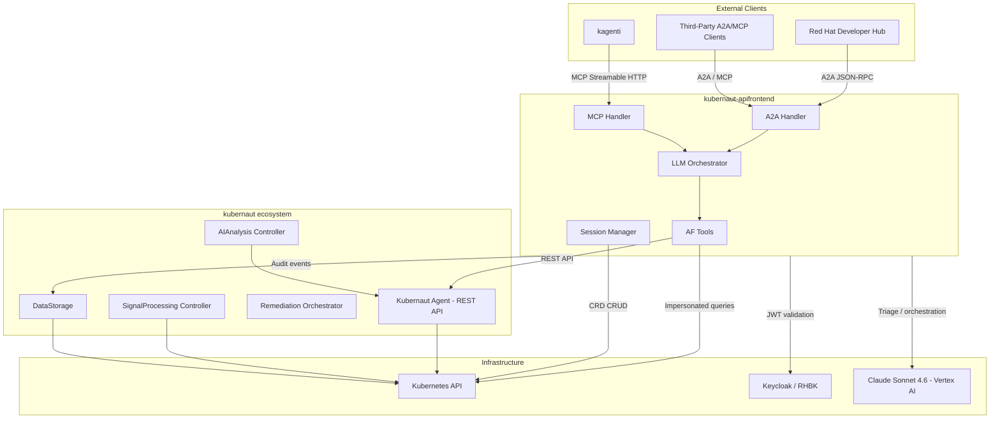
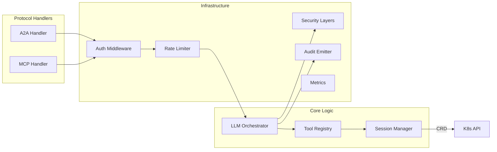
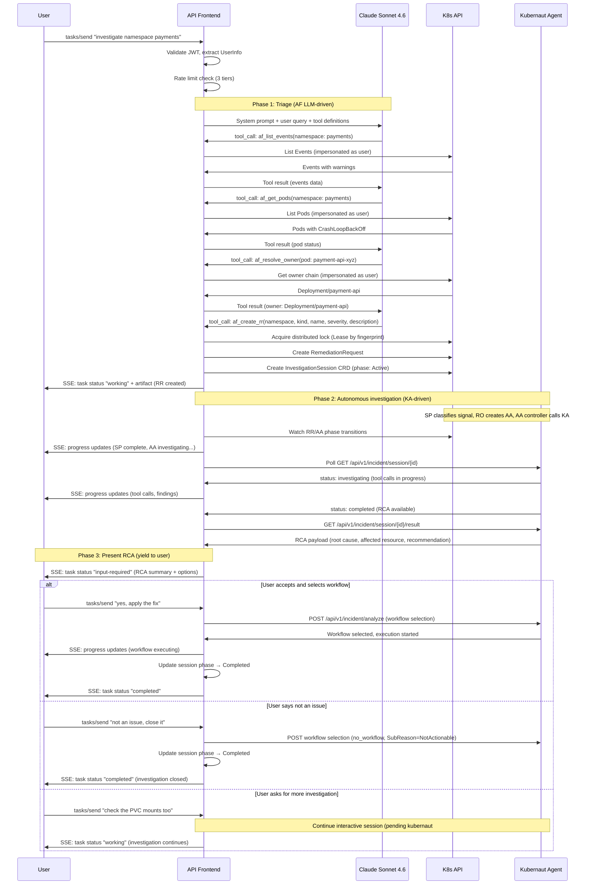
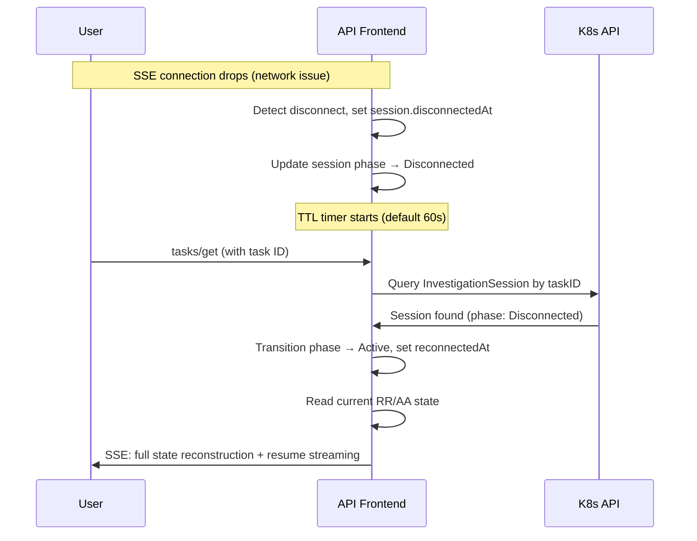
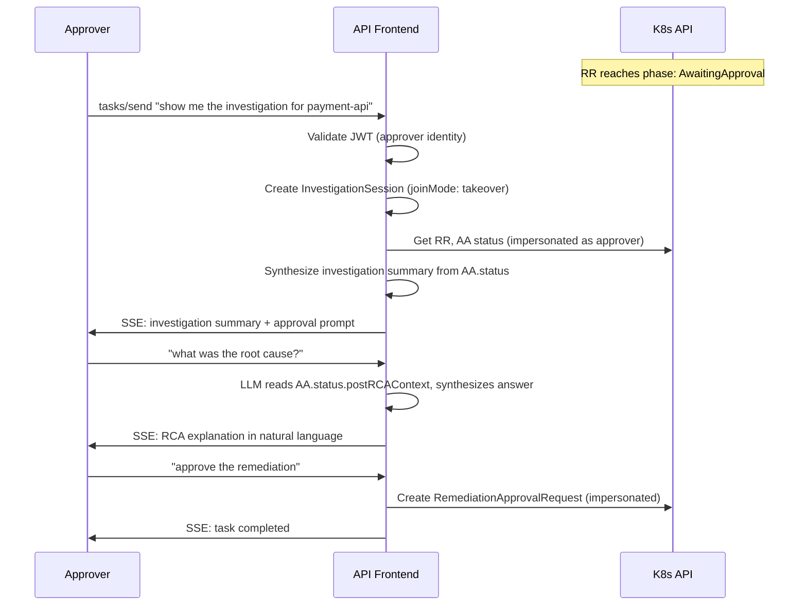
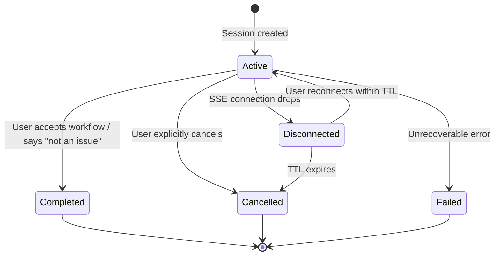
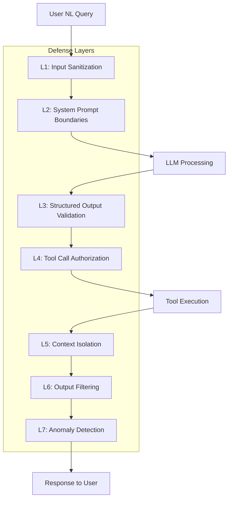

# kubernaut-apifrontend Architecture Design Document

**Version:** 1.0
**Status:** Accepted
**Last Updated:** 2026-05-03

---

## Table of Contents

1. [System Context](#1-system-context)
2. [Component Architecture](#2-component-architecture)
3. [Data Flow](#3-data-flow)
4. [CRD Design](#4-crd-design)
5. [API Surface](#5-api-surface)
6. [Security Model](#6-security-model)
7. [Observability](#7-observability)
8. [Deployment Model](#8-deployment-model)
9. [Dependency Map](#9-dependency-map)
10. [Cross-Repo Contracts](#10-cross-repo-contracts)

---

## 1. System Context

The API Frontend (AF) is the external-facing gateway for kubernaut's agentic investigation capabilities. It enables natural language (NL) driven investigation and RemediationRequest (RR) creation through the A2A and MCP protocols.



### Positioning

| Concern | Owned by |
|---------|----------|
| External authentication (OIDC/JWT) | AF |
| Natural language interpretation and triage | AF (own LLM) |
| RR creation from NL queries | AF |
| Autonomous investigation (RCA, tool calls) | KA |
| Workflow selection and execution | KA + RO |
| Session persistence (A2A tasks) | AF (InvestigationSession CRD) |
| Pipeline orchestration (SP → AA → RO) | kubernaut controllers |

### Key Principles

- **AF is stateless between requests** — the InvestigationSession CRD is the only persistent state
- **AF never escalates privileges** — all K8s API calls use user impersonation
- **AF owns triage, KA owns investigation** — separation of concerns at service boundary
- **Defense-in-depth** — JWT validation at AF + JWT validation at KA (double verification)

---

## 2. Component Architecture

### Package Layout

```
kubernaut-apifrontend/
├── api/
│   └── apifrontend/
│       └── v1alpha1/              # InvestigationSession CRD types
├── cmd/
│   └── apifrontend/
│       └── main.go                # Entry point, wires all components
├── internal/
│   ├── handler/
│   │   ├── a2a.go                 # A2A JSON-RPC request handler
│   │   ├── mcp.go                 # MCP Streamable HTTP handler
│   │   ├── agentcard.go           # /.well-known/agent-card.json
│   │   └── health.go              # /healthz, /readyz
│   ├── auth/
│   │   ├── jwt.go                 # Multi-issuer JWT validation (KEP-3331)
│   │   ├── impersonation.go       # K8s impersonation header injection
│   │   └── middleware.go          # Auth middleware chain
│   ├── llm/
│   │   ├── client.go              # LLM provider abstraction
│   │   ├── orchestrator.go        # Triage orchestration (system prompt + tools)
│   │   └── prompt.go              # System prompt construction
│   ├── tools/
│   │   ├── registry.go            # Tool registration
│   │   ├── af_list_events.go      # K8s Events query
│   │   ├── af_get_pods.go         # Pod status query
│   │   ├── af_get_workloads.go    # Workload health query
│   │   ├── af_resolve_owner.go    # Owner chain resolution
│   │   ├── af_check_existing_rr.go # RR existence check (dedup)
│   │   └── af_create_rr.go        # RemediationRequest creation
│   ├── session/
│   │   └── manager.go             # Session lifecycle (create, update, lookup)
│   ├── streaming/
│   │   ├── sse.go                 # SSE event construction and delivery
│   │   └── poller.go              # KA REST API polling → SSE synthesis
│   ├── ratelimit/
│   │   ├── request_rate.go        # Per-user request rate (token bucket)
│   │   ├── concurrency.go         # Global LLM concurrency (semaphore)
│   │   └── token_budget.go        # Per-user token budget
│   ├── security/
│   │   ├── sanitizer.go           # Input/output sanitization
│   │   ├── validator.go           # Structured output validation
│   │   └── anomaly.go             # Tool call anomaly detection
│   ├── audit/
│   │   └── emitter.go             # Audit event emission to DataStorage
│   ├── dedup/
│   │   └── lease.go               # K8s Lease-based deduplication
│   ├── controller/
│   │   └── session_cleanup.go     # InvestigationSession TTL controller
│   ├── integration/               # Integration tests
│   ├── conformance/               # Protocol conformance tests
│   └── maturity/                   # Service maturity P0 checks
├── pkg/
│   └── metrics/
│       └── metrics.go             # Prometheus metric registration
├── config/
│   ├── crd/bases/                 # Generated CRD YAML
│   ├── rbac/                      # ClusterRole, ClusterRoleBinding
│   └── local.yaml                 # Local development config
├── charts/
│   └── kubernaut-apifrontend/     # Helm chart (dev/test only)
└── docs/
    ├── design/                    # This document
    ├── adr/                       # Architecture Decision Records
    └── operations/                # Runbooks
```

### Component Responsibilities



### Key Interfaces

```go
// Tool defines the contract for AF-internal tools
type Tool interface {
    Name() string
    Description() string
    InputSchema() json.RawMessage
    Execute(ctx context.Context, params json.RawMessage, user UserInfo) (ToolResult, error)
}

// LLMClient abstracts the LLM provider
type LLMClient interface {
    Chat(ctx context.Context, messages []Message, tools []Tool, opts ChatOptions) (*Response, error)
}

// SessionStore manages InvestigationSession CRDs
type SessionStore interface {
    Create(ctx context.Context, spec SessionSpec) (*Session, error)
    Get(ctx context.Context, taskID string) (*Session, error)
    UpdatePhase(ctx context.Context, name string, phase SessionPhase, msg string) error
    FindActiveByUser(ctx context.Context, username string) ([]Session, error)
    FindActiveByRR(ctx context.Context, rrName string) ([]Session, error)
}
```

---

## 3. Data Flow

### Flow 1: NL Query → Triage → RR Creation → Investigation → User Decision



### Flow 2: User Reconnection (Disconnect → Reconnect)



### Flow 3: Remediation Approver Takeover



---

## 4. CRD Design

### InvestigationSession (`apifrontend.kubernaut.ai/v1alpha1`)

**Purpose:** Links A2A tasks to kubernaut pipeline CRDs; enables session persistence across AF restarts and user reconnections.

#### Spec (immutable after creation)

| Field | Type | Description |
|-------|------|-------------|
| `remediationRequestRef` | ObjectRef | Reference to the RR this session investigates |
| `a2aTaskID` | string | A2A task ID for client reconnection |
| `userIdentity` | UserIdentity | Username + groups from JWT |
| `joinMode` | enum | `start` (user-initiated) or `takeover` (joined running investigation) |

#### Status (mutable, AF-only)

| Field | Type | Description |
|-------|------|-------------|
| `phase` | enum | Active, Disconnected, Completed, Cancelled, Failed |
| `aiAnalysisRef` | string | Reference to AA CRD (when discovered) |
| `kaSessionID` | string | KA interactive session ID |
| `connectionState` | enum | Connected, Disconnected |
| `startedAt` | Time | Session creation timestamp |
| `completedAt` | Time | Terminal state timestamp |
| `disconnectedAt` | Time | Last disconnect timestamp |
| `reconnectedAt` | Time | Last reconnect timestamp |
| `message` | string | Human-readable state description |
| `conditions` | []Condition | Standard K8s conditions |

#### State Machine



#### Labels and Indexes

| Label | Value | Purpose |
|-------|-------|---------|
| `apifrontend.kubernaut.ai/user` | username | Reconnection lookups |
| `apifrontend.kubernaut.ai/rr-name` | RR name | Dedup / status lookups |
| `apifrontend.kubernaut.ai/phase` | phase value | Phase-based filtering |
| `app.kubernetes.io/managed-by` | kubernaut-apifrontend | Standard ownership |

#### TTL Cleanup Controller

| Phase | Retention | Action |
|-------|-----------|--------|
| Disconnected | 60s (configurable) | Transition → Cancelled |
| Completed | 24h | Delete CRD |
| Cancelled | 1h | Delete CRD |
| Failed | 24h | Delete CRD |

---

## 5. API Surface

### MCP Streamable HTTP (spec 2025-03-26)

| Endpoint | Method | Purpose |
|----------|--------|---------|
| `/mcp` | POST | JSON-RPC method dispatch (tools/list, tools/call) |
| `/mcp` | POST + `Accept: text/event-stream` | Streaming tool execution |

**Registered tools (6 AF-internal):**

| Tool | Purpose | Data source |
|------|---------|-------------|
| `af_list_events` | Query K8s Events in namespace | K8s API (impersonated) |
| `af_get_pods` | Get pod status and health | K8s API (impersonated) |
| `af_get_workloads` | Get Deployment/StatefulSet health | K8s API (impersonated) |
| `af_resolve_owner` | Resolve owner chain to root | K8s API (impersonated) |
| `af_check_existing_rr` | Check if RR already exists for resource (dedup) | K8s API (AF SA) |
| `af_create_rr` | Create RemediationRequest | K8s API (AF SA) |

### A2A Protocol (v0.3.0, JSON-RPC 2.0)

| Method | Purpose |
|--------|---------|
| `tasks/send` | Create task (NL query) or respond to input-required |
| `tasks/get` | Get task status |
| `tasks/cancel` | Cancel active task |
| `tasks/sendSubscribe` | Create task with SSE streaming |

### Agent Card

`GET /.well-known/agent-card.json` — Returns A2A AgentCard with capabilities, skills, and authentication requirements.

### Health and Metrics

| Endpoint | Port | Purpose |
|----------|------|---------|
| `/healthz` | 8443 | Liveness probe (process alive) |
| `/readyz` | 8443 | Readiness probe (dependencies reachable) |
| `/metrics` | 8080 | Prometheus metrics scrape |

---

## 6. Security Model

### 7-Layer Defense-in-Depth



| Layer | What it does | What it prevents |
|-------|-------------|-----------------|
| L1: Input Sanitization | Strip control chars, normalize Unicode, length limits | Payload smuggling, buffer overflow |
| L2: System Prompt Boundaries | XML-tagged regions, role separation | Prompt injection, role confusion |
| L3: Structured Output Validation | JSON Schema validation of LLM tool calls | Hallucinated tools, malformed params |
| L4: Tool Call Authorization | RBAC check per tool, namespace enforcement | Privilege escalation, cross-namespace access |
| L5: Context Isolation | Per-session LLM context, no cross-session state | Data leakage between users |
| L6: Output Filtering | Hybrid: structural allowlist (tools return typed fields, never raw YAML) + regex scan (JWT prefixes, cert blocks, high-entropy strings) + LLM instruction | Information disclosure |
| L7: Anomaly Detection | Track tool call patterns, abort on anomaly | Automated exploitation, runaway loops |

### Identity Chain

```
User (Keycloak JWT) → AF validates JWT → AF impersonates user for K8s API calls
                                       → AF forwards JWT to KA for investigation
```

- AF validates JWT against Keycloak JWKS (multi-issuer, KEP-3331)
- AF uses its own SA + `Impersonate-User`/`Impersonate-Group` for K8s API queries
- AF forwards original JWT to KA (`Authorization: Bearer <jwt>`) per kubernaut#1009
- KA validates same JWT via JWKS and extracts identity

### Rate Limiting (3-tier)

| Tier | Scope | Mechanism | Default |
|------|-------|-----------|---------|
| 1 | Per-user request rate | Token bucket | 30 req/min |
| 2 | Global LLM concurrency | Semaphore | 10 concurrent |
| 3 | Per-user token budget | Counter (when available) | Configurable |

HTTP 429 returned when any tier is exceeded. Tier 3 disabled when LLM provider does not report token usage.

### Circuit Breakers

| Target | Failure threshold | Half-open timeout | Success to close | Degraded behavior |
|--------|-------------------|-------------------|------------------|-------------------|
| KA REST API | 5 consecutive 5xx/timeout | 30s | 1 success | Return "investigation service unavailable" to user |
| LLM provider | 3 consecutive failures | 60s | 1 success | Return 503 with RFC 7807 detail; no queuing |
| Keycloak JWKS | 3 consecutive failures | 30s | 1 success | Use cached JWKS (cache TTL: 5min); fail-open for existing sessions, fail-closed for new |

### RBAC (ClusterRole)

AF ServiceAccount permissions:

| Resource | Verbs | Purpose |
|----------|-------|---------|
| `remediationrequests` (kubernaut.ai) | create, get, list, watch | RR lifecycle |
| `aianalyses` (kubernaut.ai) | get, list, watch | Investigation status |
| `signalprocessings` (kubernaut.ai) | get, list, watch | Signal context |
| `investigationsessions` (apifrontend.kubernaut.ai) | create, get, list, watch, update, delete | Session management |
| `leases` (coordination.k8s.io) | create, get, update, delete | Distributed locking |
| `users`, `groups` (core) | impersonate | User-scoped K8s queries |

---

## 7. Observability

### Metrics Catalog (`af_*` prefix)

**Histograms:**

| Metric | Labels | SLO |
|--------|--------|-----|
| `af_triage_duration_seconds` | outcome | P95 < 15s |
| `af_tool_call_duration_seconds` | tool, type | P99 < 500ms (internal), < 2s (proxy) |
| `af_sse_connect_duration_seconds` | — | P99 < 1s |
| `af_auth_duration_seconds` | result | P99 < 200ms |
| `af_http_request_duration_seconds` | method, path, status | — |
| `af_ka_poll_duration_seconds` | endpoint | — |

**Counters:**

| Metric | Labels |
|--------|--------|
| `af_http_requests_total` | method, path, status |
| `af_triage_total` | outcome |
| `af_tool_calls_total` | tool, result |
| `af_rate_limit_rejections_total` | tier |
| `af_llm_tokens_total` | direction, model |
| `af_audit_events_total` | type |

**Gauges:**

| Metric | Labels |
|--------|--------|
| `af_sse_connections_active` | — |
| `af_circuit_breaker_state` | target |
| `af_sessions_active` | phase |

### Structured Logging

- Library: `go.uber.org/zap` (via `logr` interface for controller-runtime compatibility)
- Format: JSON in production, console in development
- Standard fields: `requestID`, `userID`, `taskID`, `sessionName`, `tool`, `latencyMs`

### Audit Trail

7-link forensic chain emitted to DataStorage:
1. A2A request received (who, what, when)
2. Triage started (session created)
3. Tool call executed (which tool, params, result summary)
4. RR created (fingerprint, severity, target)
5. Investigation delegated (KA session ID)
6. User decision (accept/reject/cancel)
7. Session completed (outcome, duration)

---

## 8. Deployment Model

### Production (OCP via kubernaut-operator)

| Resource | Managed by |
|----------|-----------|
| Deployment (2 replicas) | Operator |
| Service (8443 app, 8080 metrics) | Operator |
| Route (edge TLS termination) | Operator |
| NetworkPolicy (OPS-3 full spec) | Operator |
| PodDisruptionBudget (minAvailable: 1) | Operator |
| ClusterRole + ClusterRoleBinding | Operator |
| ServiceAccount | Operator |
| ConfigMap (`af-config`) | Operator |
| Secret (`af-llm-credentials`) | Operator |
| ServiceMonitor | Operator |
| PrometheusRule | Operator |
| InvestigationSession CRD | Operator |
| ValidatingAdmissionPolicy | Operator |
| SCC binding (restricted-v2) | Operator (default on OCP) |

### Development (Helm chart)

```bash
helm install af charts/kubernaut-apifrontend \
  --set llm.provider=vertexanthropic \
  --set llm.model=claude-sonnet-4-6-20250514 \
  --set auth.issuerURL=http://keycloak:8080/realms/kubernaut \
  --set kubernautAgent.pollInterval=5s \
  --set kubernautAgent.circuitBreaker.failureThreshold=5 \
  --set kubernautAgent.circuitBreaker.halfOpenTimeout=30s
```

### Local Development (no cluster)

```bash
make run-mocks    # Start mock KA + mock JWKS + mock LLM
make run-local    # AF binary with config/local.yaml
```

---

## 9. Dependency Map

### Go Module Dependencies

AF imports from the kubernaut monorepo (`github.com/jordigilh/kubernaut`):

| Package | Purpose |
|---------|---------|
| `api/remediation/v1alpha1` | RR CRD types |
| `api/aianalysis/v1alpha1` | AA CRD types |
| `api/signalprocessing/v1alpha1` | SP CRD types |
| `pkg/shared/types` | EnrichmentResults, DetectedLabels |
| `pkg/gateway/types` | SHA256 fingerprinting (`ResolveFingerprint`), owner resolution |
| `pkg/gateway/processing` | Signal processing types |

**Version pinning:**
- Dev: `go.mod` points to kubernaut `development/v1.5` branch
- CI: pinned to latest tagged commit on `development/v1.5`
- Release: pinned to kubernaut release tag (e.g., `v1.5.0`)

### External Dependencies

| Dependency | Purpose | Version |
|-----------|---------|---------|
| controller-runtime | CRD management, reconcilers, leader election | v0.19+ |
| LangChainGo (or direct Anthropic SDK) | LLM provider abstraction | Latest |
| go-jose/v4 | JWT validation, JWKS fetching | v4.x |
| prometheus/client_golang | Metrics registration | v1.20+ |
| zap | Structured logging | v1.27+ |

### KA REST API Contract

| Endpoint | Method | Purpose | Status |
|----------|--------|---------|--------|
| `/api/v1/incident/analyze` | POST | Start investigation session | Implemented |
| `/api/v1/incident/session/{id}` | GET | Poll session status | Implemented |
| `/api/v1/incident/session/{id}/result` | GET | Get completed investigation result | Implemented |

**Phase 2: Interactive endpoints** (pending kubernaut#874):

| Endpoint | Method | Purpose |
|----------|--------|---------|
| `/api/v1/incident/session/{id}/takeover` | POST | User takes over autonomous investigation |
| `/api/v1/incident/session/{id}/message` | POST | User sends message during interactive session |
| `/api/v1/incident/session/{id}/cancel` | POST | User cancels active investigation |

AF authenticates to KA by forwarding the user's original Keycloak JWT in the `Authorization` header.

**Poll configuration:**
- Default interval: 5s (configurable via `kubernautAgent.pollInterval` in Helm values)
- Circuit breaker: 5 consecutive failures → open (30s half-open timeout, 1 success to close)
- Timeout per poll: 10s
- Backoff on error: exponential (1s, 2s, 4s, 8s, capped at 30s)

**Throughput ceiling:** With Tier 2 global concurrency = 10 and average triage duration = 15s, the system supports ~40 triages/minute at steady state. Exceeding this queues requests behind the semaphore (HTTP 429 after configurable wait timeout).

---

## 10. Cross-Repo Contracts

### kubernaut (core) — Required for AF

| Issue | What AF needs | Status | Blocker? |
|-------|--------------|--------|----------|
| #1014 | `signal_mode=manual` in SP/AA enums | Open | Yes (E2E) |
| #1015 | `severity=unknown` in DataStorage enum | Open | Yes (E2E) |
| #1009 | Pattern B JWT trust-boundary (AF→KA identity delegation) | Open | Yes (E2E) |
| #874 | KA interactive session REST API: takeover, message/send, cancel endpoints | Open | Yes (E2E) |
| #1017 | LLM-derived severity as distinct field | Open | No (enhancement) |
| #893 | KA NetworkPolicy allows AF ingress | Closed | N/A |

### kubernaut-operator — Required for Production

| Issue | What operator deploys | Status |
|-------|----------------------|--------|
| #30 | AF Deployment (umbrella) | Open |
| #42 | InvestigationSession CRD + ValidatingAdmissionPolicy | Open |
| #43 | ServiceMonitor + PrometheusRule | Open |
| #44 | Full AF NetworkPolicy (OPS-3) | Open |
| #45 | PDB + SCC + resource limits + probes | Open |

### Contract Stability

AF uses kubernaut's Go types directly. Contract tests (QE-4) run in CI to detect breaking changes:
- CRD field existence (compile-time via Go types)
- Enum value completeness (runtime reflection)
- KA REST API response schema (JSON Schema validation)

Nightly job runs against kubernaut `main` for early break detection.

---

## References

- GitHub Issues: #41-#56, #57-#71 (design comments)
- ADRs: `docs/adr/ADR-001` through `ADR-012`
- kubernaut PROPOSAL-EXT-003 Appendix B (delegated authorization model)
- MCP Spec: https://spec.modelcontextprotocol.io/specification/2025-03-26/
- A2A Spec: https://google.github.io/A2A/specification/
