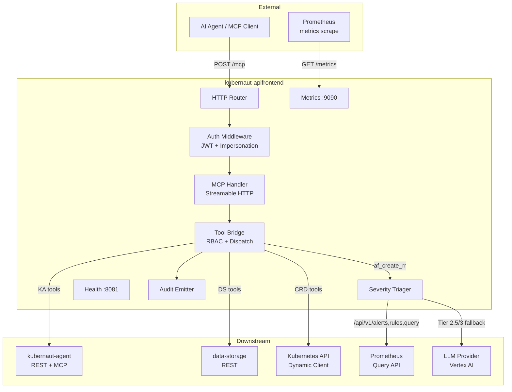
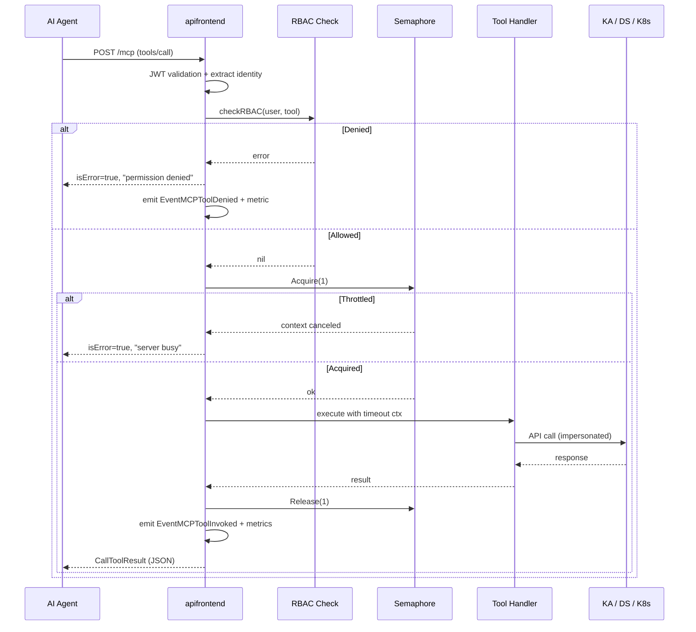
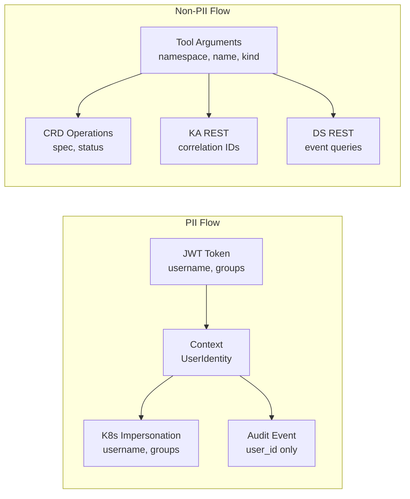

# Data Flow Diagram

## System Context

## Request Flow: MCP Tool Call

## Data Classification by Flow

## Downstream Dependencies

| Downstream | Protocol | Auth | Circuit Breaker | Retry | Timeout |
|-----------|----------|------|-----------------|-------|---------|
| Kubernetes API | Dynamic Client | Impersonation | Yes (K8s-specific) | No | 30s |
| kubernaut-agent | REST + MCP | JWT forwarding | Yes | 2 retries, exp backoff | 30s |
| data-storage | REST (ogen) | Service identity | Yes | 3 retries, exp backoff | 10s |
| Prometheus | HTTP `/api/v1/*` | Bearer token (SA) | Planned | No | 30s |
| LLM Provider (Vertex AI) | gRPC/HTTP | ADC | Yes | No | Configurable |

## Error Redaction

All errors flowing back to the AI agent are redacted:
- URLs (any scheme) → `[URL_REDACTED]`
- File paths → `[PATH_REDACTED]`
- Secrets in values → `[REDACTED]`

The original error is logged server-side with full context for SRE diagnosis.
