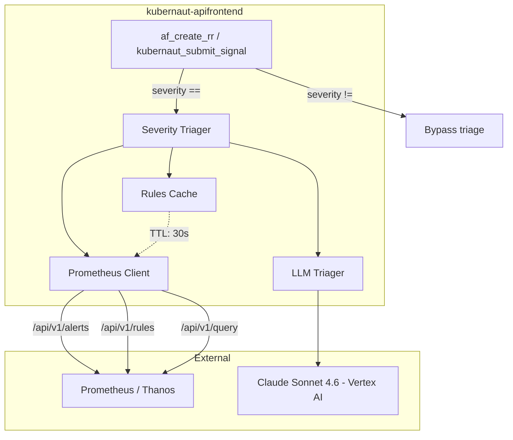
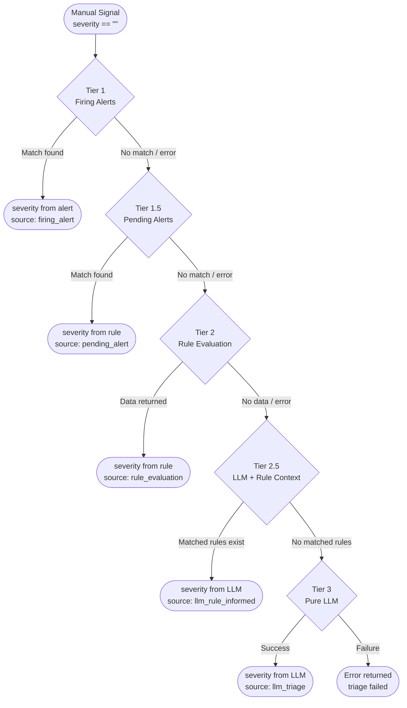
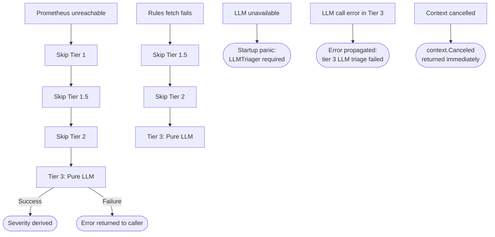
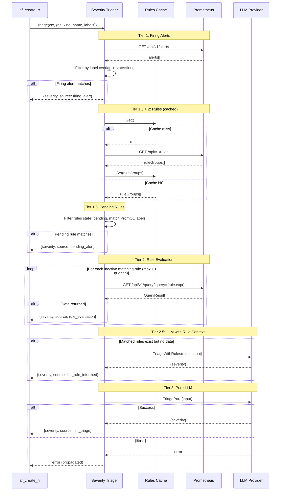

# Severity Triage Design Document

**Version:** 1.0
**Status:** Accepted
**Last Updated:** 2026-05-10
**Issue:** [#92](https://github.com/jordigilh/kubernaut-apifrontend/issues/92)
**NIST Controls:** AU-2 (Auditable Events), AU-12 (Audit Record Generation), SI-4 (System Monitoring), SC-8 (Transmission Confidentiality)

---

## Table of Contents

1. [Problem Statement](#1-problem-statement)
2. [Architecture Overview](#2-architecture-overview)
3. [Triage Pipeline](#3-triage-pipeline)
4. [Component Design](#4-component-design)
5. [Integration Points](#5-integration-points)
6. [Configuration](#6-configuration)
7. [Security Model](#7-security-model)
8. [Observability](#8-observability)
9. [Failure Modes and Degradation](#9-failure-modes-and-degradation)
10. [Data Flow Diagram](#10-data-flow-diagram)
11. [Decision Log](#11-decision-log)
12. [Cross-References](#12-cross-references)

---

## 1. Problem Statement

When a manual signal arrives (via `af_create_rr` or `kubernaut_submit_signal`) without a user-supplied severity, the API Frontend must determine severity before creating the `RemediationRequest` CRD. Without severity, the kubernaut pipeline cannot classify, prioritize, or route the remediation.

### Goals

- Derive severity deterministically from Prometheus alerting state when possible
- Fall back to LLM classification when deterministic triage is inconclusive
- Record the triage source for auditability (FedRAMP AU-2)
- Degrade gracefully when Prometheus is unreachable
- Never assume a default severity — all code paths must produce a justified result or fail

### Non-Goals

- Modifying the kubernaut CRD schema (severity is set via existing `spec.severity` field)
- Deploying or managing Prometheus alerting rules (operator scope)
- Replacing user-supplied severity (explicit severity always wins)

---

## 2. Architecture Overview

The severity triage pipeline is a new subsystem within the API Frontend that sits between tool argument parsing and CRD creation. It queries Prometheus for real-time alerting state and falls back to LLM classification when alerts and rules are insufficient.



### Package Layout

```
internal/
├── prometheus/
│   ├── client.go          # HTTP client for /api/v1/{alerts,rules,query}
│   ├── types.go           # Alert, RuleGroup, Rule, QueryResult, Sample
│   └── rules.go           # ExtractLabelMatchers, MatchesResource (PromQL AST)
├── severity/
│   ├── triage.go          # Triager orchestrator (5-tier pipeline)
│   ├── types.go           # TriageInput, TriageResult, Source, severity utils
│   ├── cache.go           # RulesCache (TTL, sync.RWMutex)
│   └── llm.go             # LLMTriager interface implementation
```

---

## 3. Triage Pipeline

The pipeline runs five tiers in order. Each tier is a deterministic checkpoint — the first tier that produces a result wins. If no tier produces a result, the pipeline returns an error.



### Tier Descriptions

| Tier | Source | Mechanism | Latency |
|------|--------|-----------|---------|
| **1** | Prometheus `/api/v1/alerts` | Filter firing alerts by resource label overlap; pick highest severity | ~50ms |
| **1.5** | Prometheus `/api/v1/rules` (cached) | Filter rules in `pending` state by PromQL label matcher overlap with resource labels | ~5ms (cached) |
| **2** | Prometheus `/api/v1/query` | For `inactive` rules whose PromQL matchers overlap, evaluate the expression via instant query; if data returns, inherit rule severity | ~100ms per query |
| **2.5** | LLM (rule-informed) | When Tier 2 rules matched but yielded no data, send rule definitions + resource context to the LLM for classification | ~2-5s |
| **3** | LLM (pure fallback) | No rules covered the resource; LLM classifies from resource context alone | ~2-5s |

### Severity Ordering

When multiple alerts or rules match, the highest severity wins:

```
critical (5) > high (4) > medium (3) > low (2) > info (1)
```

### Invariants

- **LLM is mandatory.** `NewTriager` panics if the `LLMTriager` is nil. The pipeline must guarantee a result or an explicit error — silent defaults are prohibited.
- **User severity wins.** If `args.Severity != ""`, triage is skipped entirely.
- **No user input in PromQL.** All PromQL expressions originate from Prometheus `/api/v1/rules` responses. User-supplied strings are never interpolated into queries.
- **Context propagation.** Every tier checks `ctx.Err()` between executions and respects cancellation.

---

## 4. Component Design

### 4.1 Prometheus Client (`internal/prometheus`)

The client wraps three Prometheus HTTP API v1 endpoints. It follows the kubernaut `prometheusHTTPClient` pattern from `pkg/effectivenessmonitor/client/prometheus_http.go`.

#### Interface

```go
type Client interface {
    GetAlerts(ctx context.Context) ([]Alert, error)
    GetRules(ctx context.Context) ([]RuleGroup, error)
    InstantQuery(ctx context.Context, query string) (*QueryResult, error)
}
```

#### Safety Measures

| Measure | Implementation |
|---------|---------------|
| Response body limit | `io.LimitReader(resp.Body, 10MB)` |
| Error redaction | All errors wrapped through `security.RedactError` before returning |
| Context propagation | `http.NewRequestWithContext` on every request |
| TLS support | Caller provides pre-configured `*http.Client` with CA and bearer token |

### 4.2 PromQL Label Extraction (`internal/prometheus/rules.go`)

Two functions extract label selectors from PromQL ASTs and match them against resource labels:

- **`ExtractLabelMatchers(expr string)`** — Parses PromQL via `promql/parser`, walks the AST with `parser.Inspect`, collects `VectorSelector` label matchers (excluding `__name__`). Returns error for invalid PromQL — never panics.

- **`MatchesResource(matchers, resourceLabels)`** — Returns `true` when all matchers are satisfied by the resource labels. Supports equality (`=`), inequality (`!=`), and regex (`=~`, `!~`) matchers via the `labels.Matcher.Matches()` method.

### 4.3 Triager (`internal/severity/triage.go`)

The orchestrator struct holds all dependencies:

```go
type Triager struct {
    promClient prom.Client
    llm        LLMTriager     // mandatory — panics if nil at construction
    config     Config
    logger     logr.Logger
    cache      *RulesCache
}
```

Each tier is implemented as a separate method (`runTier1`, `runTier15`, `runTier2`, `runTier25`, `runTier3`) called sequentially by `Triage()`.

### 4.4 Rules Cache (`internal/severity/cache.go`)

TTL-based cache for `/api/v1/rules` responses, shared between Tier 1.5 and Tier 2 within a single triage invocation and across invocations within the TTL window.

| Property | Value |
|----------|-------|
| TTL | Configurable (default: 30s) |
| Thread safety | `sync.RWMutex` |
| Eviction | Lazy (checked on `Get()`) |
| Growth bound | Single cached value (not a map) — no unbounded growth |
| Copy semantics | `Get()` and `Set()` copy the slice to prevent mutation |

### 4.5 LLM Triager (`internal/severity`)

Interface for LLM-based severity classification:

```go
type LLMTriager interface {
    TriageWithRules(ctx context.Context, rules []prom.Rule, input TriageInput) (TriageResult, error)
    TriagePure(ctx context.Context, input TriageInput) (TriageResult, error)
}
```

The prompt is constructed by `BuildTriagePrompt` which:
- Includes resource context (namespace, kind, name, description)
- Filters sensitive labels (password, token, secret, key, credential, bearer)
- For Tier 2.5, includes matched rule names, expressions, annotations, and configured severity
- Instructs the LLM to respond with exactly one of: `critical`, `high`, `medium`, `low`, `info`

LLM responses are validated against the `validSeverities` allowlist and normalized (lowercased, trimmed).

---

## 5. Integration Points

### 5.1 Tool Integration

The triage pipeline is invoked from tool handlers when severity is empty:

```
af_create_rr(severity: "")
    → Triager.Triage(ctx, TriageInput{namespace, kind, name, description, labels})
    → TriageResult{Severity: "high", Source: "firing_alert", AlertName: "HighErrorRate"}
    → RR spec.severity = "high"
    → RR spec.signalLabels = {"severity_source": "firing_alert", "severity_alert_name": "HighErrorRate"}
```

### 5.2 Signal Labels

Triage metadata is persisted on the RR CRD via `spec.signalLabels`:

| Key | Value | When Set |
|-----|-------|----------|
| `severity_source` | `firing_alert`, `pending_alert`, `rule_evaluation`, `llm_rule_informed`, `llm_triage` | Always |
| `severity_alert_name` | Alert name from Tier 1 | Tier 1 only |
| `severity_rule_name` | Rule name from Tier 1.5/2/2.5 | Tier 1.5/2/2.5 only |

### 5.3 Downstream Dependencies

| Dependency | Protocol | Auth | Timeout |
|-----------|----------|------|---------|
| Prometheus | HTTP `/api/v1/*` | Bearer token (ServiceAccount) | 30s (configurable) |
| LLM Provider | gRPC/HTTP (Vertex AI) | Application Default Credentials | Existing LLM timeout |
| Kubernetes API | Dynamic Client | Impersonation / SA | Existing tool timeout |

---

## 6. Configuration

New `SeverityTriage` section in the YAML config:

```yaml
severityTriage:
  enabled: true
  prometheusURL: "http://prometheus:9090"
  cacheTTLSeconds: 30
  maxQueriesPerCall: 10
  maxRulesEvaluated: 100
  llmConfidence: 0.7
  prometheus:
    tlsCaFile: ""                    # optional: custom CA for Prometheus TLS
    bearerTokenFile: ""              # optional: /var/run/secrets/.../token
```

| Field | Default | Required | Purpose |
|-------|---------|----------|---------|
| `enabled` | `true` | No | Feature flag to disable triage entirely |
| `prometheusURL` | — | Yes (when enabled) | Base URL for Prometheus API |
| `cacheTTLSeconds` | `30` | No | TTL for `/api/v1/rules` cache |
| `maxQueriesPerCall` | `10` | No | Max instant queries per triage invocation |
| `maxRulesEvaluated` | `100` | No | Max inactive rules evaluated in Tier 2 |
| `llmConfidence` | `0.7` | No | Minimum confidence threshold for LLM results |

### Startup Validation

- If `enabled=true` and `prometheusURL` is empty → startup error (fail-fast)
- If `llmConfidence` is outside `[0.0, 1.0]` → startup error
- If `LLMTriager` dependency is nil → panic at `NewTriager` construction

---

## 7. Security Model

### 7.1 PromQL Injection Prevention

All PromQL expressions originate from Prometheus `/api/v1/rules` responses (server-controlled). User input is never interpolated into query strings. The `ExtractLabelMatchers` function only reads the AST — it does not construct queries from user data.

### 7.2 Error Redaction

Prometheus HTTP errors may contain internal cluster URLs, IP addresses, or path information. All errors from the Prometheus client are wrapped through `security.RedactError` before being returned to callers or emitted in audit events. Redaction rules:

| Pattern | Replacement |
|---------|------------|
| URLs (any scheme) | `[URL_REDACTED]` |
| File paths | `[PATH_REDACTED]` |
| Secrets in values | `[REDACTED]` |

### 7.3 LLM Prompt Safety

The `BuildTriagePrompt` function filters sensitive labels before including them in the LLM prompt. Labels with keys matching `password`, `token`, `secret`, `key`, `credential`, or `bearer` are excluded. Namespace, kind, and name are included by design — they are required for classification and are not considered PII in the kubernaut context.

### 7.4 TLS and Authentication

The Prometheus client supports:
- **TLS CA file** — Custom CA certificate pool for mTLS environments (FedRAMP SC-8)
- **Bearer token file** — ServiceAccount token for Prometheus authentication, read from the standard mount path

### 7.5 FedRAMP Control Mapping

| Control | Implementation |
|---------|---------------|
| AU-2 (Auditable Events) | `EventSeverityTriageCompleted` and `EventSeverityTriageFailed` audit events |
| AU-12 (Audit Record Generation) | Triage result (tier, severity, source, duration) recorded in audit trail |
| SC-8 (Transmission Confidentiality) | TLS CA support for Prometheus; east-west mTLS via service mesh |
| SI-4 (System Monitoring) | `af_severity_triage_*` metrics; `ApifrontendSeverityTriageErrorRate` alert |
| AC-6 (Least Privilege) | Prometheus queries use SA token; user impersonation not needed for read-only metrics |

---

## 8. Observability

### 8.1 Metrics

| Metric | Type | Labels | Purpose |
|--------|------|--------|---------|
| `af_severity_triage_total` | Counter | `tier`, `severity` | Triage completions by tier and result |
| `af_severity_triage_duration_seconds` | Histogram | `tier` | Latency per tier execution |
| `af_severity_triage_errors_total` | Counter | `tier`, `error_type` | Tier-level errors (HTTP, parse, timeout) |

### 8.2 Audit Events

| Event Type | NIST | Trigger | Detail Fields |
|-----------|------|---------|---------------|
| `severity.triage.completed` | AU-2, AU-12 | Triage produces a result | `tier`, `severity`, `source`, `duration_ms`, `alert_name`, `rule_name` |
| `severity.triage.failed` | AU-2 | All tiers fail or LLM error | `error` (redacted), `tier` (last attempted) |

### 8.3 Alerting Rules

| Alert | Expression | Severity | For |
|-------|-----------|----------|-----|
| `ApifrontendSeverityTriageErrorRate` | `rate(af_severity_triage_errors_total[5m]) > 0.1` | warning | 5m |

### 8.4 SLO Impact

| SLO | Impact |
|-----|--------|
| SLO-3 (CRD tool p99 < 500ms) | Triage adds latency to `af_create_rr`. Tier 1 adds ~50ms. Tier 3 (LLM) adds 2-5s. Triage timeout is separate from tool timeout. |
| SLO-6 (5xx rate < 0.1%) | LLM failure in Tier 3 returns an error to the caller. This is a deliberate fail-safe — not a silent degradation. |

---

## 9. Failure Modes and Degradation



### Degradation Matrix

| Failure | Tier 1 | Tier 1.5 | Tier 2 | Tier 2.5 | Tier 3 | Outcome |
|---------|--------|----------|--------|----------|--------|---------|
| Prometheus down | Skip | Skip | Skip | Skip (no rules) | Execute | LLM result or error |
| Rules fetch fails | OK | Skip | Skip | Skip (no rules) | Execute | LLM result or error |
| Single query fails | OK | OK | Skip that rule | OK | Fallback | Best-effort from earlier tiers |
| LLM nil at startup | — | — | — | — | — | **Panic** (fail-fast) |
| LLM call error | OK | OK | OK | Log + continue | Error | **Error returned** |
| Context cancelled | — | — | — | — | — | `context.Canceled` immediately |

### Key Design Decision: No Silent Defaults

The pipeline **never** silently defaults to a hardcoded severity. If the LLM triager is nil, the system panics at startup. If the LLM call fails at Tier 3 (the last resort), the error is propagated to the caller. This ensures that every severity value is justified and traceable.

---

## 10. Data Flow Diagram

### Complete Triage Sequence



---

## 11. Decision Log

| ID | Decision | Rationale | Date |
|----|----------|-----------|------|
| DL-1 | LLM is mandatory (panic on nil) | Cannot assume severity — every value must be justified or the system must fail explicitly | 2026-05-10 |
| DL-2 | No `SourceDefault` / hardcoded fallback | Silent defaults mask pipeline failures and produce unjustified severity values | 2026-05-10 |
| DL-3 | PromQL from server only, never user input | Prevents PromQL injection; all expressions originate from Prometheus rule definitions | 2026-05-02 |
| DL-4 | Lazy cache eviction (no background goroutine) | Avoids goroutine lifecycle complexity; TTL checked on read is sufficient for 30s window | 2026-05-02 |
| DL-5 | `security.RedactError` on all Prometheus errors | Internal URLs and paths must not leak to callers or audit events (FedRAMP SC-8) | 2026-05-02 |
| DL-6 | Sensitive label filtering in LLM prompt | Labels named `password`, `token`, `secret`, `key`, `credential`, `bearer` excluded from prompts | 2026-05-02 |
| DL-7 | `signalLabels` map for triage metadata (not CRD schema change) | Avoids modifying the kubernaut RR CRD schema; flexible key-value storage | 2026-05-02 |
| DL-8 | Tier 2 rate limited to 10 queries per invocation | Prevents one triage call from overwhelming Prometheus with hundreds of instant queries | 2026-05-02 |
| DL-9 | Tier 3 LLM error propagated (not swallowed) | If the last resort fails, the caller must know — swallowing the error produces an empty result | 2026-05-10 |

---

## 12. Cross-References

| Document | Relevance |
|----------|-----------|
| `docs/design/ARCHITECTURE.md` | System context, observability catalog, security model |
| `docs/design/DATA_FLOW.md` | MCP tool call flow, error redaction model |
| `docs/design/TOOL_EXECUTION_MODEL.md` | Input validation, output safety, deduplication |
| `docs/security/AUDIT_EVENT_CATALOG.md` | New `severity.triage.*` events to be added |
| `docs/slo/SLO_DEFINITIONS.md` | SLO-3 (CRD tool latency) impacted by triage |
| `docs/tests/92/test_plan.md` | 86 test cases covering all tiers and edge cases |
| `docs/adr/ADR-020-mcp-bridge-rbac-runtime.md` | RBAC enforcement model (runtime only) |
| `docs/operations/runbooks/RB-AF-010.md` | Triage troubleshooting runbook (planned) |
| kubernaut `DD-SEVERITY-001 v1.1` | Canonical severity values and determination model |
| kubernaut `pkg/effectivenessmonitor/client/prometheus_http.go` | Reference Prometheus client pattern |

---

*Source files: `internal/prometheus/client.go`, `internal/prometheus/rules.go`, `internal/prometheus/types.go`, `internal/severity/triage.go`, `internal/severity/types.go`, `internal/severity/cache.go`*
