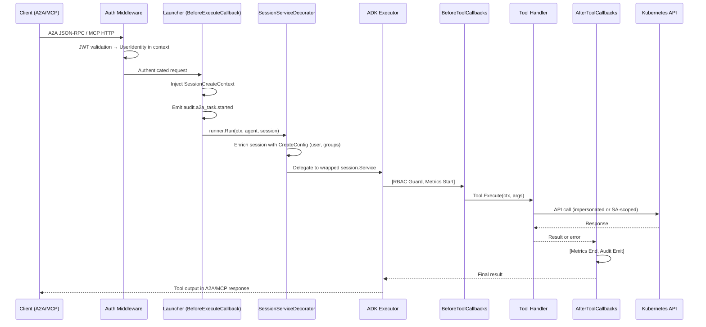

# Tool Execution Model

**Service:** kubernaut-apifrontend
**NIST Controls:** AU-12 (Audit Record Generation), AC-3 (Access Enforcement), SI-10 (Information Input Validation)
**Source of truth:** `internal/agent/root.go`, `internal/auth/dynamic_impersonation.go`, `internal/tools/helpers.go`, `internal/validate/k8s.go`
**Last updated:** 2026-05-08

---

## 1. Request Lifecycle

Every tool call traverses a deterministic pipeline from protocol ingress to Kubernetes API call and back.



---

## 2. Callback Chain Ordering

The ADK agent is configured with explicit callback ordering that provides a security-observability sandwich around every tool execution.

### Before Tool Callbacks (ordered)

| Position | Callback | Purpose | Failure Behavior |
|----------|----------|---------|-----------------|
| 1 | **RBAC Guard** | Checks `UserIdentity.Groups` against `rbac_roles.yaml` | Returns `{"error": "forbidden: ..."}` + emits `rbac.denied` audit event |
| 2 | **Metrics Start** | Records `time.Now()` in `sync.Map` keyed by `FunctionCallID` | No-op on nil metrics (graceful degradation) |

### After Tool Callbacks (ordered)

| Position | Callback | Purpose | Failure Behavior |
|----------|----------|---------|-----------------|
| 1 | **Metrics End** | Computes duration, increments `af_tool_calls_total{tool,result}`, observes `af_tool_call_duration_seconds{tool,type}` | No-op on nil metrics |
| 2 | **Audit Emit** | Emits `tool.invoked` event with tool name, result status, user ID, namespace | No-op on nil auditor (never blocks tool result) |

### Invariants

- Callbacks never mutate the tool result (return `nil, nil` to pass through)
- Callbacks never block: audit emission is buffered and async
- RBAC guard is fail-closed: missing identity or unknown role → reject
- Metrics callbacks are fail-open: nil counters → skip silently

---

## 3. Client Resolution Model

Tools access the Kubernetes API through two distinct client scopes, determined at construction time:

```
┌─────────────────────────────────────────────────────┐
│                 Tool Registration                     │
├─────────────────────────────────────────────────────┤
│                                                     │
│  ┌───────────────────────┐  ┌─────────────────────┐│
│  │ Triage Tools (read)   │  │ CRD Tools (write)   ││
│  │ af_list_events        │  │ kubernaut_*          ││
│  │ af_get_pods           │  │ af_check_existing_rr ││
│  │ af_get_workloads      │  │ af_create_rr         ││
│  │ af_resolve_owner      │  │                      ││
│  └──────────┬────────────┘  └──────────┬───────────┘│
│             │                           │            │
│             ▼                           ▼            │
│  DynamicClientFactory         Static dynamic.Interface│
│  (per-request impersonation)  (AF ServiceAccount)    │
└─────────────────────────────────────────────────────┘
```

### DynamicClientFactory (Impersonated)

```go
type DynamicClientFactory func(ctx context.Context) (dynamic.Interface, error)
```

- Called at tool execution time (not at construction)
- Extracts `UserIdentity` from context
- Creates a `rest.Config` with `Impersonation{UserName, Groups}`
- Returns a fresh `dynamic.Interface` scoped to the calling user's RBAC
- **Fail-closed:** Returns error if no identity present
- **Never cached:** A new client per request prevents identity leakage

### Static Client (ServiceAccount)

- Created once at startup from in-cluster config
- Wrapped in `resilience.ResilientDynamicClient` (circuit breaker protection)
- Used for AF-owned CRD operations where the AF is the resource owner
- User identity is recorded in CRD labels/spec (not via impersonation)

### Fallback Behavior

If no `ImpersonatingClientFactory` is provided (e.g., running outside a cluster), triage tools fall back to `StaticDynamicFactory(k8sClient)` — the SA client is used for all operations.

---

## 4. Input Validation Contract

Every tool validates inputs before making K8s API calls. Validation is centralized in the `internal/validate` package.

### Validation Functions

| Function | Validates | Standard | Error Wrapping |
|----------|-----------|----------|----------------|
| `validate.Namespace(ns)` | RFC 1123 DNS label (≤63 chars, lowercase alphanumeric + hyphens) | K8s namespace rules | `ErrInvalidInput` |
| `validate.ResourceName(name)` | RFC 1123 DNS subdomain (≤253 chars) | K8s resource name rules | `ErrInvalidInput` |
| `validate.LabelValue(v)` | K8s label value constraints (≤63 chars, optional) | K8s label spec | `ErrInvalidInput` |

### Per-Tool Validation

| Tool | Validated Fields | Additional Checks |
|------|-----------------|-------------------|
| af_list_events | namespace | — |
| af_get_pods | namespace | label_selector format |
| af_get_workloads | namespace | — |
| af_resolve_owner | namespace, pod_name | — |
| af_check_existing_rr | namespace, kind, name | — |
| af_create_rr | namespace, kind, name | Description truncated at 2048 chars |
| kubernaut_submit_signal | namespace/name via ParseRRID | — |
| kubernaut_approve | namespace/name via ParseRRID | — |

### Error Wrapping Pattern

```go
if err := validate.Namespace(args.Namespace); err != nil {
    return Result{}, fmt.Errorf("%w: %v", ErrInvalidInput, err)
}
```

The `ErrInvalidInput` sentinel allows callers to distinguish validation failures from runtime errors via `errors.Is`.

---

## 5. Output Safety

Tool outputs are bounded to prevent excessive data from reaching the LLM context or etcd (via session storage).

### TrimSliceToFit Generic

```go
func TrimSliceToFit[T any](items []T) ([]T, bool)
```

- Maximum output size: **4096 bytes** (JSON serialized)
- Removes trailing elements until the serialization fits
- Returns `(trimmedSlice, wasTrimmed)` so tools can signal truncation to the user
- Matches the session `TrimToolResult` threshold for etcd safety

### Tools Using TrimSliceToFit

| Tool | Output Type | Truncation Signal |
|------|------------|-------------------|
| af_list_events | `[]EventSummary` | `"truncated": true` in result |
| af_get_pods | `[]PodSummary` | `"truncated": true` in result |
| af_get_workloads | `[]WorkloadSummary` | `"truncated": true` in result |

### Error Translation

`ToUserFriendlyError` translates Kubernetes API errors into safe, user-facing messages:

| K8s Status Code | User-Facing Message | Purpose |
|----------------|--------------------|---------| 
| 403 Forbidden | "you lack access to ... — contact your cluster administrator" | Strips internal field paths |
| 404 Not Found | "the requested resource does not exist" | Hides namespace/resource details |
| 409 Conflict | "operation conflict — the resource was modified concurrently, please retry" | Actionable guidance |
| Other | "operation failed (code N) — contact your cluster administrator" | Safe generic fallback |

---

## 6. Deduplication (singleflight)

The `af_create_rr` tool uses `golang.org/x/sync/singleflight` to prevent duplicate RemediationRequest creation from concurrent LLM tool calls.

### Fingerprint Calculation

```go
fingerprint = SHA256(namespace + "/" + kind + "/" + name)[:16]  // hex-encoded
```

### Deduplication Flow

```
af_create_rr(ns, kind, name)
    │
    ▼
rrFingerprint(ns, kind, name) → key
    │
    ▼
singleflight.Group.Do(key, func() {
    1. HandleCheckExistingRR → check for non-terminal RR
    2. If exists → return AlreadyExists result
    3. If not → Create RR via K8s API
})
    │
    ▼
Result (shared if concurrent calls had same fingerprint)
```

### Safety Net

Even without singleflight, `HandleCheckExistingRR` acts as an idempotency guard — it queries for non-terminal RRs with matching labels before creation. The singleflight eliminates redundant K8s API calls during the same execution window.

---

## 7. Error Sentinel Types

| Sentinel | Package | Meaning | Typical Trigger |
|----------|---------|---------|-----------------|
| `ErrNotFound` | tools | Resource does not exist | K8s 404 |
| `ErrForbidden` | tools | User lacks RBAC permission | K8s 403 (via impersonation) |
| `ErrAlreadyTerminal` | tools | RR is in Completed/Failed/Cancelled state | Approve/Cancel on finished RR |
| `ErrK8sUnavailable` | tools | No K8s client configured | nil client at startup |
| `ErrInvalidInput` | tools | Input validation failure | Bad namespace, empty required field |

All sentinels support `errors.Is` for programmatic handling in tests and upstream callers.

---

*Source files: `internal/agent/root.go`, `internal/auth/dynamic_impersonation.go`, `internal/tools/helpers.go`, `internal/tools/af_create_rr.go`, `internal/validate/k8s.go`, `internal/launcher/launcher.go`, `internal/session/decorator.go`*
