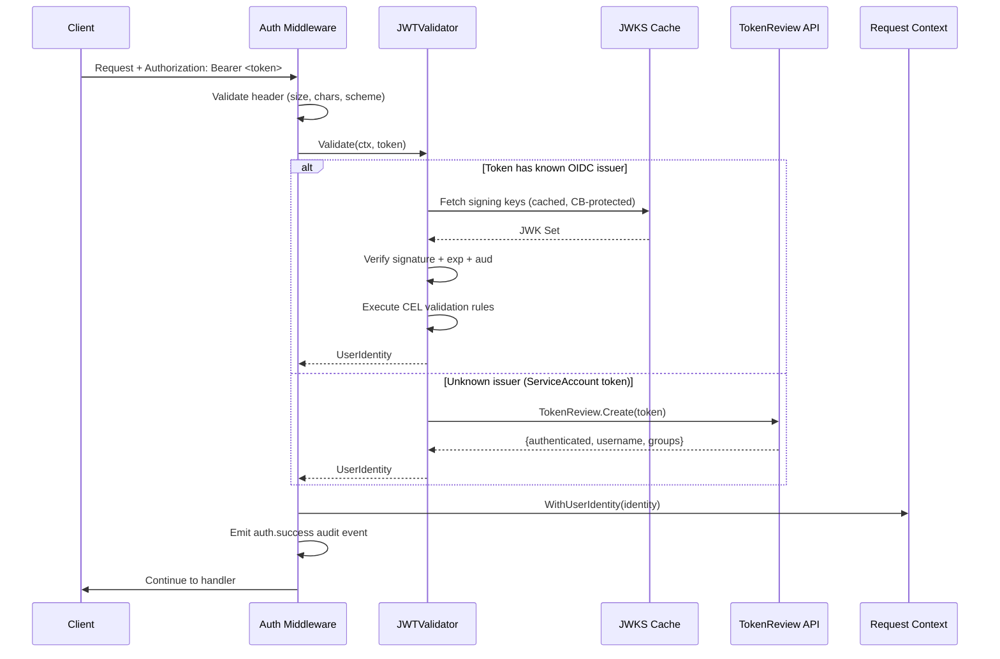
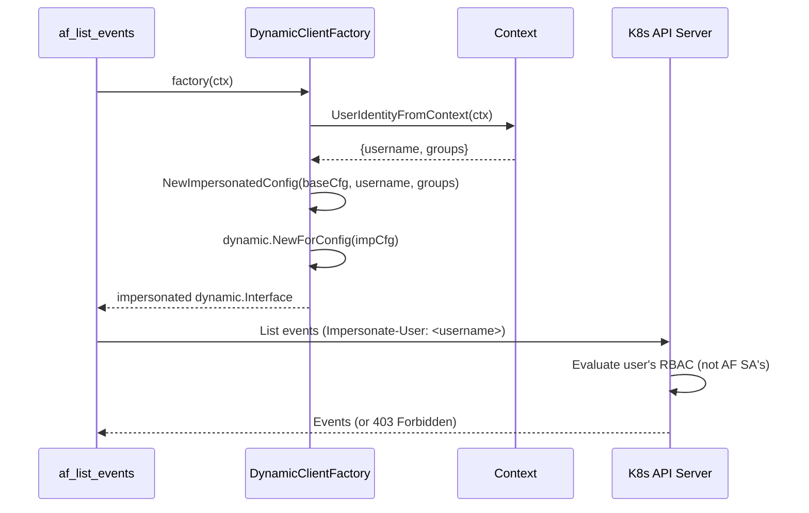

# Authentication and RBAC Model

**Service:** kubernaut-apifrontend
**NIST Controls:** AC-2, AC-3, AC-6, IA-2, IA-5, IA-8
**Source of truth:** `internal/auth/`, `internal/agent/rbac_roles.yaml`
**Last updated:** 2026-05-08

---

## 1. Authentication Flow

Every request to the API Frontend must carry a valid Bearer token. The authentication pipeline validates the token through a multi-stage process.



### Validation Stages

| Stage | Code Location | Failure Mode |
|-------|--------------|--------------|
| Body size enforcement | `middleware.go` L45 | 413 if > 1MB |
| Header sanitization | `security.ValidateHeaderValue` | 400 if control chars |
| Bearer scheme check | `middleware.go` L71-78 | 401 if non-Bearer |
| OIDC signature verification | `jwt.go` JWTValidator.Validate | 401 if signature invalid |
| Expiry validation | Claims.exp check | 401 `token_expired` |
| Audience validation | Claims.aud vs configured audiences | 401 `invalid_audience` |
| CEL rule evaluation | Compiled CEL programs per provider | 401 `cel_rule_failed` |
| TokenReview fallback | `tokenreview.go` K8s API call | 401 if not authenticated |

### JWKS Caching and Circuit Breaker

The `JWKSCache` fetches provider signing keys with:
- In-memory cache with TTL refresh
- Circuit breaker to prevent cascading failures if the OIDC provider is down
- Fail-open semantics: if cache has valid keys and circuit is open, validation continues with cached keys (see ADR-016)

---

## 2. RBAC Model

After authentication, tool-level access control is enforced by a `BeforeToolCallback` registered in the ADK agent. The model is **fail-closed**: if no role match is found, the tool call is rejected and an `rbac.denied` audit event is emitted.

### Role Assignment

Roles are derived from the `groups` claim in the JWT token. The group-to-role mapping is defined externally (OIDC provider configuration). The AF maps roles to tool permissions.

### Role Definitions

| Role | Purpose | Tool Count |
|------|---------|-----------|
| `sre` | Full operational access — all tools | 20 |
| `ai-orchestrator` | Automated agent — remediation + triage | 16 |
| `observability` | Dashboard / monitoring integration — read + triage | 8 |
| `l3-audit` | Forensic analysis — history, audit trail, effectiveness | 6 |
| `cicd` | CI/CD pipeline integration — signal submission + status | 4 |
| `remediation-approver` | Human approval gate — approve/reject only | 4 |

### Tool Permission Matrix

| Tool | sre | ai-orch | observ | l3-audit | cicd | approver |
|------|-----|---------|--------|----------|------|----------|
| kubernaut_list_remediations | Y | Y | Y | Y | Y | Y |
| kubernaut_get_remediation | Y | Y | Y | Y | Y | Y |
| kubernaut_submit_signal | Y | Y | | | Y | |
| kubernaut_approve | Y | Y | | | | Y |
| kubernaut_cancel_remediation | Y | Y | | | | |
| kubernaut_watch | Y | Y | Y | | Y | Y |
| kubernaut_start_investigation | Y | Y | | | | |
| kubernaut_poll_investigation | Y | Y | | | | |
| kubernaut_select_workflow | Y | Y | | | | |
| present_decision | Y | Y | | | | |
| kubernaut_list_workflows | Y | | Y | Y | | |
| kubernaut_get_remediation_history | Y | | | Y | | |
| kubernaut_get_effectiveness | Y | | Y | Y | | |
| kubernaut_get_audit_trail | Y | | | Y | | |
| af_list_events | Y | Y | Y | | | |
| af_get_pods | Y | Y | Y | | | |
| af_get_workloads | Y | Y | Y | | | |
| af_resolve_owner | Y | Y | | | | |
| af_check_existing_rr | Y | Y | | | | |
| af_create_rr | Y | Y | | | | |

### Enforcement Mechanism

```
BeforeToolCallback (RBAC Guard)
  1. Extract UserIdentity from context
  2. If nil → REJECT (fail-closed)
  3. Map user groups to roles via GroupMapping
  4. Check if any role grants the requested tool
  5. If no match → REJECT + emit rbac.denied audit event
  6. If match → ALLOW (proceed to tool execution)
```

---

## 3. Kubernetes Impersonation Model

The AF uses two distinct client scopes when making K8s API calls:

| Scope | Client Type | Tools | Rationale |
|-------|------------|-------|-----------|
| User Impersonation | Per-request `dynamic.Interface` with impersonation headers | af_list_events, af_get_pods, af_get_workloads, af_resolve_owner | User only sees what their K8s RBAC permits (AC-6) |
| Service Account | Static AF SA `dynamic.Interface` | All kubernaut_* tools, af_check_existing_rr, af_create_rr | AF manages its own CRDs; user does not need direct CRD access |

### Impersonation Flow



### Security Properties

- The AF ServiceAccount requires the `impersonate` verb on `users` and `groups` resources (granted by ClusterRole)
- A user cannot escalate beyond their own K8s RBAC, even if their AF role grants the tool
- The impersonated config is created per-request and never cached (prevents identity leakage)

---

## 4. Kubernetes RBAC (ClusterRole)

The Helm-managed ClusterRole grants the AF ServiceAccount:

| API Group | Resources | Verbs | Purpose |
|-----------|-----------|-------|---------|
| `kubernaut.ai` | remediationrequests, remediationapprovalrequests, signalprocessings, investigationsessions | get, list, watch, create, update, patch, delete | CRD lifecycle management |
| `kubernaut.ai` | */status | get, update, patch | Status subresource updates |
| (core) | events, pods, replicationcontrollers | get, list | Triage tool reads (via impersonation) |
| `apps` | deployments, statefulsets, replicasets, daemonsets | get, list | Workload triage |
| `batch` | jobs, cronjobs | get, list | Job triage |
| `authentication.k8s.io` | tokenreviews | create | JWT fallback validation |
| `authorization.k8s.io` | subjectaccessreviews | create | Authorization checks |

---

## 5. Credential Lifecycle

| Credential | Type | Rotation | Storage |
|-----------|------|----------|---------|
| OIDC signing keys | JWKS (RS256/ES256) | Auto-refreshed from provider `.well-known/jwks.json` | In-memory cache |
| AF ServiceAccount token | K8s projected volume | Auto-rotated by kubelet (1h default) | tmpfs mount |
| User JWT | OIDC token | Short-lived (provider-configured, typically 5-60min) | Not stored; validated per-request |

---

## 6. Related ADRs

| ADR | Title | Relevance |
|-----|-------|-----------|
| ADR-013 | JWT Forwarding to KA | Original JWT forwarded byte-identical to downstream services |
| ADR-016 | JWKS Fail-Open Rationale | When circuit breaker opens, cached keys allow validation to continue |
| ADR-018 | Impersonation Risk Acceptance | Documents accepted risk of impersonation model |

---

*Source files: `internal/auth/middleware.go`, `internal/auth/jwt.go`, `internal/auth/tokenreview.go`, `internal/auth/impersonation.go`, `internal/auth/dynamic_impersonation.go`, `internal/agent/rbac_roles.yaml`, `deploy/helm/templates/clusterrole.yaml`*
