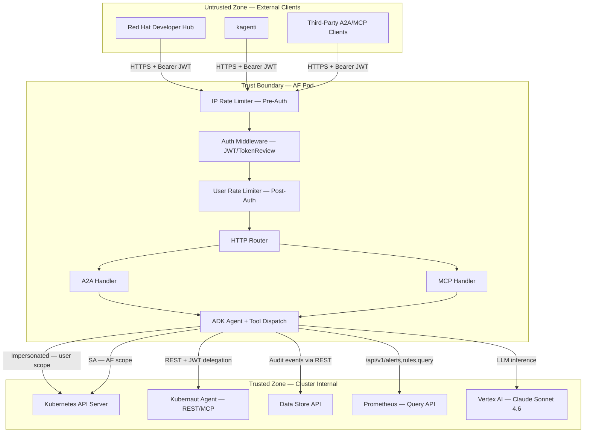

# Service Boundary Definition

**Service:** kubernaut-apifrontend
**NIST Controls:** SC-7 (Boundary Protection), SC-8 (Transmission Confidentiality), SC-13 (Cryptographic Protection), AC-4 (Information Flow Enforcement)
**Source of truth:** `cmd/apifrontend/main.go`, `deploy/kustomize/base/`, `internal/ratelimit/`, `internal/resilience/`
**Last updated:** 2026-05-08

---

## 1. Trust Boundary Diagram



---

## 2. Ingress Points

All ingress enters through a single HTTP listener on the configured port (default 8080). There is no secondary listener or sidecar port.

| Endpoint | Protocol | Auth Required | Purpose |
|----------|----------|---------------|---------|
| `POST /` | A2A JSON-RPC 2.0 | Yes (Bearer JWT) | Agent task execution |
| `POST /mcp` | MCP Streamable HTTP | Yes (Bearer JWT) | MCP tool invocation |
| `GET /mcp/sse` | Server-Sent Events | Yes (Bearer JWT) | Streaming MCP responses |
| `GET /.well-known/agent.json` | HTTP GET | No | A2A Agent Card discovery |
| `GET /healthz` | HTTP GET | No | Liveness probe (kubelet) |
| `GET /readyz` | HTTP GET | No | Readiness probe (kubelet) |
| `GET /metrics` | HTTP GET | No | Prometheus metrics scrape |

### HTTP Server Hardening

| Setting | Value | Rationale |
|---------|-------|-----------|
| ReadTimeout | 60s | Prevents slow-read attacks |
| ReadHeaderTimeout | 10s | Limits header-only slow loris |
| IdleTimeout | 120s | Reclaims idle keep-alive connections |
| WriteTimeout | 0 (disabled) | Required for SSE/streaming; per-request deadlines via `SetWriteDeadline()` |
| MaxBodySize | 1 MB (`http.MaxBytesReader`) | Prevents memory exhaustion on request body |

---

## 3. Egress Points

| Destination | Protocol | Client Type | Auth Mechanism | Circuit Breaker |
|-------------|----------|-------------|----------------|-----------------|
| Kubernetes API Server | HTTPS (in-cluster TLS) | `dynamic.Interface` | ServiceAccount token (projected volume) | `k8s-api` CB |
| Kubernaut Agent (KA) REST | HTTPS | Custom `ka.Client` | JWT delegation (original user token) | `ka` CB |
| Kubernaut Agent (KA) MCP | HTTPS | `ka.SDKMCPClient` | JWT delegation (`ContextJWTDelegationTransport`) | — |
| Data Store (DS) | HTTPS | ogen-generated client | ServiceAccount context | `ds-rest` CB |
| Prometheus (triage) | HTTP/HTTPS | `prometheus.Client` | Bearer token (SA projected volume) | Planned |
| Vertex AI (LLM) | HTTPS | ADK genai client | GCP Workload Identity | — |

---

## 4. Encryption in Transit

| Connection | TLS Requirement | Certificate Source |
|------------|----------------|-------------------|
| Client → AF ingress | TLS 1.2+ (terminated at Ingress/Route) | Cluster cert manager or ACME |
| AF → K8s API Server | mTLS (in-cluster) | SA projected token + cluster CA |
| AF → KA REST | TLS 1.2+ | Cluster internal CA |
| AF → DS REST | TLS 1.2+ | Cluster internal CA |
| AF → Prometheus | TLS 1.2+ (optional, configurable CA) | Cluster internal CA or custom CA file |
| AF → Vertex AI | TLS 1.3 | Google public CA |

**Note:** Pod-to-pod communication within the cluster relies on the network CNI's encryption capabilities (e.g., WireGuard in Cilium) or service mesh mTLS if deployed. The AF itself terminates TLS at the Ingress controller level; the pod listens on plain HTTP internally.

---

## 5. Rate Limiting and DoS Protection

Rate limiting is applied as a layered defense at the service boundary:

```
Request → [IP Rate Limiter] → [Auth Middleware] → [User Rate Limiter] → Handler
                 ↓ reject              ↓ reject            ↓ reject
              429 + audit            401 + audit         429 + audit
```

### Pre-Authentication (IP-Based)

| Parameter | Default | Hot-Reloadable |
|-----------|---------|----------------|
| Requests per second per IP | 10 | Yes |
| Burst (token bucket capacity) | 20 | Yes |
| Stale entry eviction interval | 5 min | No |
| Maximum entry age | 10 min | No |

### Post-Authentication (User-Based)

| Parameter | Default | Hot-Reloadable |
|-----------|---------|----------------|
| Requests per minute per user | 30 | Yes |
| Max concurrent sessions per user | 5 | No (requires restart) |
| Tool calls per minute per user | 60 | Yes |

### Denial Events

Both rate limiter tiers emit structured audit events (`ratelimit.denied`) containing:
- Source IP (pre-auth) or User ID (post-auth)
- Limiter type (`ip` or `user`)
- Current limit values

---

## 6. Resilience at the Boundary (Egress Protection)

Each egress dependency is protected by a circuit breaker to prevent cascading failures:

| Dependency | Library | Failure Threshold | Half-Open Window | Metrics |
|-----------|---------|-------------------|-----------------|---------|
| `k8s-api` | `sony/gobreaker/v2` | Configurable (default 5) | Configurable timeout | `circuit_breaker_state` gauge |
| `ka` | `sony/gobreaker/v2` | Configurable | Configurable | `circuit_breaker_state` gauge |
| `ds-rest` | `sony/gobreaker/v2` | Configurable | Configurable | `circuit_breaker_state` gauge |

Additionally, the KA and DS clients use retry transports with exponential backoff:
- Configurable max retries, initial backoff, max backoff
- Only retries on configured HTTP status codes (e.g., 502, 503, 504)
- Retry attempts tracked in `downstream_retry_total` counter

---

## 7. Network Policy Recommendations

Cluster administrators should enforce the following `NetworkPolicy` constraints:

```yaml
# Allow ingress only from known sources (Ingress controller, monitoring)
apiVersion: networking.k8s.io/v1
kind: NetworkPolicy
metadata:
  name: kubernaut-apifrontend-ingress
spec:
  podSelector:
    matchLabels:
      app.kubernetes.io/name: kubernaut-apifrontend
  policyTypes: [Ingress]
  ingress:
    - from:
        - namespaceSelector:
            matchLabels:
              network.openshift.io/policy-group: ingress
      ports:
        - port: 8080
          protocol: TCP
    - from:
        - namespaceSelector:
            matchLabels:
              kubernetes.io/metadata.name: openshift-monitoring
      ports:
        - port: 8080
          protocol: TCP
---
# Allow egress only to known destinations
apiVersion: networking.k8s.io/v1
kind: NetworkPolicy
metadata:
  name: kubernaut-apifrontend-egress
spec:
  podSelector:
    matchLabels:
      app.kubernetes.io/name: kubernaut-apifrontend
  policyTypes: [Egress]
  egress:
    # K8s API Server
    - to:
        - ipBlock:
            cidr: <api-server-cidr>/32
      ports:
        - port: 6443
          protocol: TCP
    # KA service (same namespace or cross-namespace)
    - to:
        - podSelector:
            matchLabels:
              app.kubernetes.io/name: kubernaut-agent
      ports:
        - port: 8443
          protocol: TCP
    # DS service
    - to:
        - podSelector:
            matchLabels:
              app.kubernetes.io/name: kubernaut-datastorage
      ports:
        - port: 8443
          protocol: TCP
    # Vertex AI (external)
    - to:
        - ipBlock:
            cidr: 0.0.0.0/0
      ports:
        - port: 443
          protocol: TCP
    # DNS resolution
    - to: []
      ports:
        - port: 53
          protocol: UDP
        - port: 53
          protocol: TCP
```

---

## 8. Graceful Shutdown Sequence

The AF implements an ordered shutdown to prevent data loss at the boundary:

1. **Signal received** (SIGINT/SIGTERM)
2. **Readiness probe fails** (`readyz` returns 503) — LB stops routing new traffic
3. **SSE drain** — Active streaming connections receive close frames (5s timeout)
4. **HTTP drain** — `srv.Shutdown()` waits for in-flight requests (30s timeout)
5. **Audit flush** — Buffered audit events are flushed to DS (5s timeout)
6. **Logger sync** — Final log messages flushed to stderr

---

*Source files: `cmd/apifrontend/main.go`, `internal/ratelimit/`, `internal/resilience/`, `deploy/kustomize/base/`, `docs/design/ARCHITECTURE.md`*
